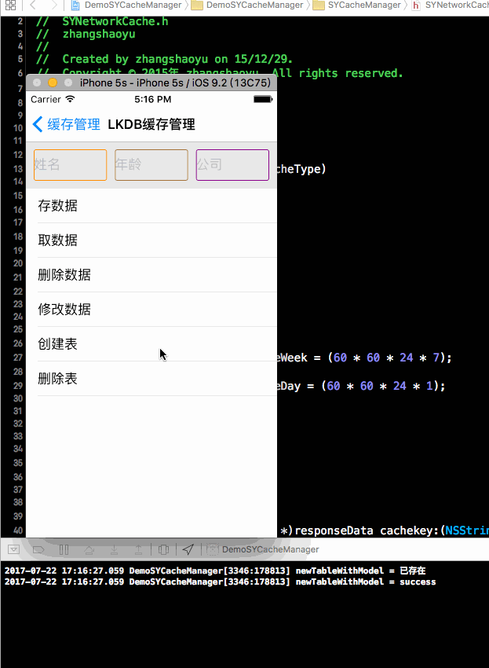

# SYCacheManager
缓存数据管理
使用FMDB、LKDBHelper进行二次封装使用。

# 效果图

# 使用示例
~~~ javascript
#import "SYCacheManager.h"
~~~

~~~ javascript
// 创建表
[[SYCacheManager shareCache] newTableWithModel:[LKDBModel class]];
~~~

~~~ javascript
// 删除表
[[SYCacheManager shareCache] deleteTableWithModel:[LKDBModel class]];
~~~ 

~~~ javascript
// 保存
LKDBModel *model = [LKDBModel new];
model.name = @"devZhang";
model.age = @"30";
model.company = @"VSTECS";

[[SYCacheManager shareCache] saveModel:model];
~~~

~~~ javascript
// 删除
NSString *company = @"VSTECS";
NSString *where = [NSString stringWithFormat:@"company = '%@'", company];

// 方法1
[[SYCacheManager shareCache] deleteModel:[LKDBModel class] where:where];

// 方法2
NSArray *array = [self.cacheManager readModel:[LKDBModel class] where:where];
LKDBModel *model = array.firstObject;
[self.cacheManager deleteModel:model];

// 方法3
[self.cacheManager deleteModel:model callback:^(BOOL result) {

}];
~~~ 

~~~ javascript
// 修改
NSString *name = @"devZhang";
NSString *where = [NSString stringWithFormat:@"name = '%@'", name];

// 方法1
NSArray *array = [self.cacheManager readModel:[LKDBModel class] where:where];
LKDBModel *model = array.firstObject;
[[SYCacheManager shareCache] updateModel:model];

// 方法2
[self.cacheManager updateModel:[LKDBModel class] value:@"age = 1, company = 'company:1'" where:where];

// 方法3
NSArray *array = [self.cacheManager readModel:[LKDBModel class] where:where];
LKDBModel *model = array.firstObject;
[self.cacheManager updateModel:model callback:^(BOOL result) {

}];
~~~ 

~~~ javascript
// 查找
NSString *age = @"30";
NSString *where = [NSString stringWithFormat:@"age > '%d'", age];

// 方法1 查找符合条件的所有数据
NSArray *array = [[SYCacheManager shareCache] readModel:[LKDBModel class] where:where];

// 方法2 查找符合条件的，按年龄升序的，第11个数据开始的10个数据，且只要姓名和年龄信息
NSArray *array = [self.cacheManager readModel:[LKDBModel class] column:@"name,age" where:where orderBy:@"age asc" offset:10 count:10];

// 方法3
[self.cacheManager readModel:[LKDBModel class] where:where callback:^(NSMutableArray *array) {

}];
~~~ 

~~~ javascript
// 删除
NSString *company = @"VSTECS";
NSString *where = [NSString stringWithFormat:@"company = '%@'", company];

// 方法1
[[SYCacheManager shareCache] deleteModel:[LKDBModel class] where:where];

// 方法2
NSArray *array = [self.cacheManager readModel:[LKDBModel class] where:where];
LKDBModel *model = array.firstObject;
[self.cacheManager deleteModel:model];

// 方法3
NSArray *array = [self.cacheManager readModel:[LKDBModel class] where:where];
LKDBModel *model = array.firstObject;
[self.cacheManager deleteModel:model callback:^(BOOL result) {

}];
~~~

# 修改说明
* 版本号：1.0.2
  * 修改时间：20171222
  * 修改内容：
    * 添加回调处理方法
      * 插入数据方法回调
      * 更新数据方法回调
      * 删除数据方法回调
      * 读取数据方法回调
  * 添加读取方法
    * 多条件读取数据方法：查询条件、查询偏移量、查询条数、查询字段、查询排序字段

